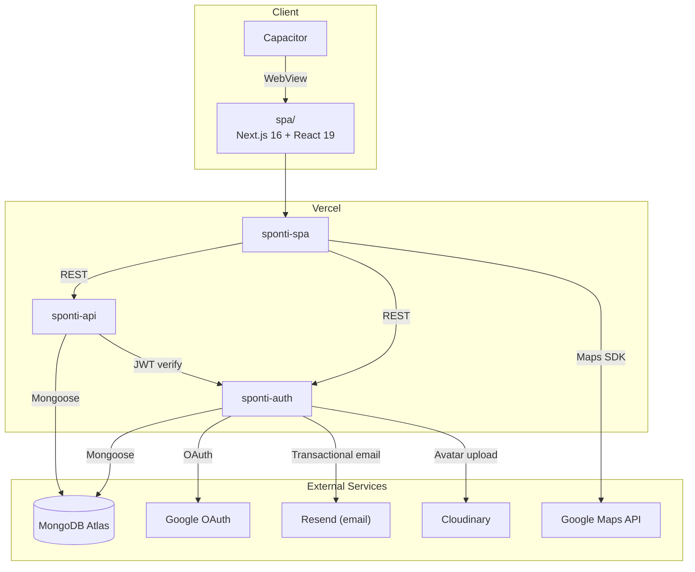

<p align="center">
  
  
  
  
  
  
  
  
</p>

<h1 align="center">Sponti</h1>

<p align="center">
  <strong>light a flare. friends show up.</strong>
</p>

<p align="center">
  A social meetup app that makes getting together effortless — broadcast what you're doing, see who's nearby, and let friends tap in. Built as a 16-day bootcamp final project by a team of 4.
</p>

---

## What is Sponti

Most plans die in the group chat. Sponti replaces the "anyone wanna do something?" thread with a single action: **light a flare**. A flare is a broadcast — you're going for coffee, hitting the park, studying at the library — and your friends can join with one tap.

- **Map view** shows what's happening *right now* around you
- **Calendar view** shows what's coming up *soon*
- Both views render the same event object, just filtered by timing — no artificial "spontaneous vs. planned" distinction

The app is designed for low-friction, low-noise coordination among trusted circles: create in under 10 seconds, join in one tap, no spam notifications.

---

## Tech Stack

### Frontend — `spa/`

| Layer | Technology |
|-------|-----------|
| Framework | Next.js 16 (App Router) + React 19 |
| Language | TypeScript 5 |
| Styling | Tailwind CSS 4 + shadcn (Nova preset) + Radix UI |
| Maps | Google Maps via `@vis.gl/react-google-maps` |
| Icons | Lucide React |
| Mobile | Capacitor 7 (iOS + Android WebView wrapper) |
| Testing | Vitest + Testing Library |
| Bundler | Turbopack |

### API Server — `api/`

| Layer | Technology |
|-------|-----------|
| Runtime | Node.js + Express 5 |
| Language | TypeScript 6 |
| Database | MongoDB Atlas + Mongoose 9 |
| Validation | Zod 4 |
| Auth | JWT verification middleware |
| Testing | Vitest + Supertest |

### Auth Server — `auth-server/`

| Layer | Technology |
|-------|-----------|
| Runtime | Node.js + Express 5 |
| Auth | JWT (access + refresh tokens) + bcrypt |
| OAuth | Google Auth (google-auth-library) |
| Email | Resend |
| Uploads | Cloudinary + Multer |
| Validation | Zod 4 |

### Deployment

All three services deploy independently to **Vercel**. MongoDB Atlas handles persistence. Cloudinary stores user-uploaded media.

---

## Architecture



---

## Repository Structure

```
sponti/
├── spa/                  # Next.js frontend (App Router)
│   ├── app/              # Routes: auth, event, circles, profile, settings, qr
│   ├── components/       # Shared components: map, calendar, event sheets, nav
│   ├── components/ui/    # shadcn base components (Nova preset)
│   ├── hooks/            # Custom React hooks
│   ├── lib/              # Utilities, API client, auth helpers
│   └── public/           # Static assets
├── api/                  # Express business API
│   └── src/
│       ├── controllers/  # Route handlers
│       ├── models/       # Mongoose schemas
│       ├── routes/       # Express routers
│       ├── schemas/      # Zod validation
│       └── services/     # Business logic
├── auth-server/          # Express auth service
│   └── src/
│       ├── controllers/  # Auth handlers (register, login, OAuth)
│       ├── models/       # User model
│       ├── routes/       # Auth routes
│       └── middleware/    # JWT verification
├── ios/                  # Capacitor iOS project (Xcode)
└── android/              # Capacitor Android project
```

---

## Features

- **Flare creation** — title, time (now/soon/scheduled), location via map pin, visibility per circle
- **Interactive map** — live flares rendered as markers with host avatars, tap to view details
- **Calendar view** — week/month toggle for upcoming events with day-level filtering
- **Event details** — host info, attendee list, RSVP/join/leave, route with ETA
- **Circles** — friend groups used as privacy scopes for flare visibility
- **Auth** — email/password + Google OAuth, JWT access/refresh token flow
- **Profile** — avatar upload, display name, QR code for adding friends
- **Dark mode** — full light/dark theme with custom brand tokens
- **Mobile-ready** — Capacitor wraps the SPA for native iOS and Android builds

---

## Getting Started

### Prerequisites

- Node.js 20+
- npm
- MongoDB Atlas connection string (or local MongoDB)
- Google Maps API key

### Run locally

```bash
# Frontend
cd spa
npm install
npm run dev              # → localhost:3000

# API server
cd api
npm install
npm run dev              # → localhost:4000

# Auth server
cd auth-server
npm install
npm run dev              # → localhost:5000
```

### Mobile (Capacitor)

```bash
cd spa
npm run build:mobile     # Build + sync to native projects
npx cap run ios          # Run in iOS Simulator
npx cap run android      # Run in Android Emulator
```

---

## Team

Built in 16 days as a bootcamp final project — from concept to deployed cross-platform app.

| Name | Role | Focus |
|------|------|-------|
| **Patrick Caire** | UX/UI Lead | Initiated the concept. Led the MVP workshop defining core user stories and user flows. Designed wireframes, the visual system, and brand identity. Acted as Product Owner — reviewed all UX-affecting work before merge. Built frontend components and design QA. |
| **Nil Angelats** | Technical Lead | Architected the monorepo, backend services, and auth system. Set up the Express + MongoDB + JWT stack, Capacitor integration, and Vercel deployment pipeline. Final technical vote on architecture decisions. |
| **Samara Arzt** | Implementation Lead | Core feature delivery end-to-end: event creation, RSVP flow, detail pages, frontend/backend integration, data validation, and feature QA. |
| **Martin Lindholm** | Project Coordinator | Scope management, sprint planning, acceptance criteria, QA/smoke testing, seed data, demo preparation, and stakeholder communication. |

---

## License

This project was built as an educational bootcamp final project.
